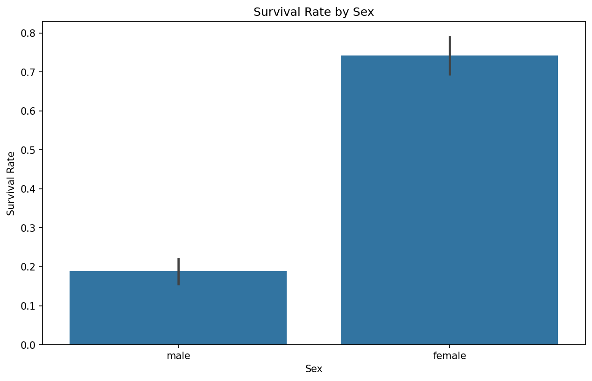
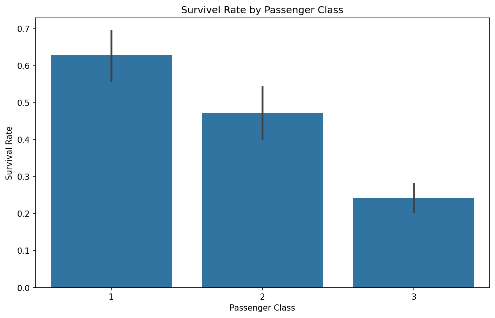
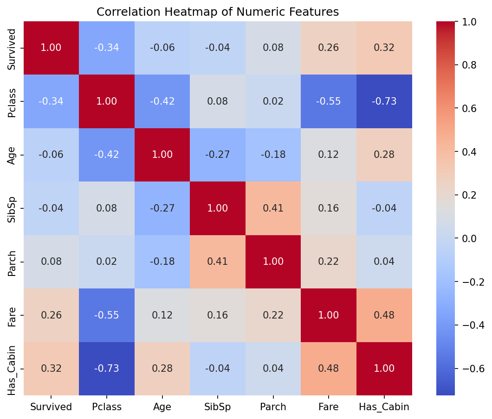
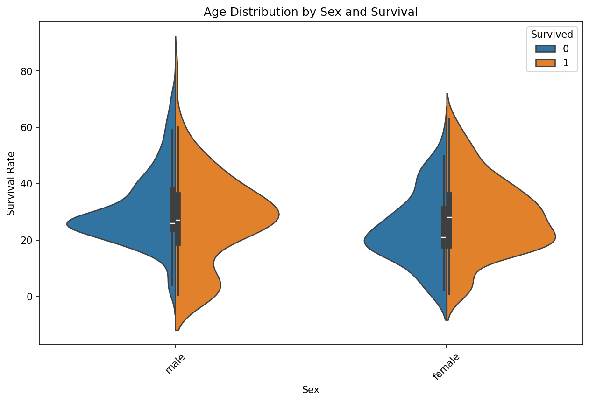
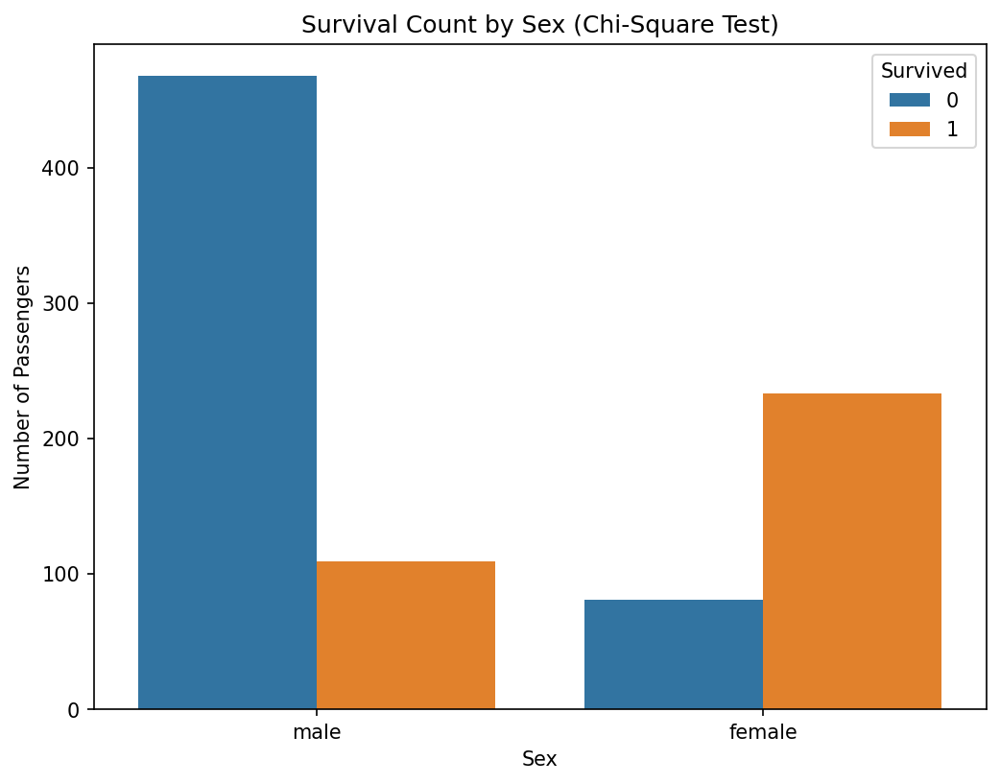
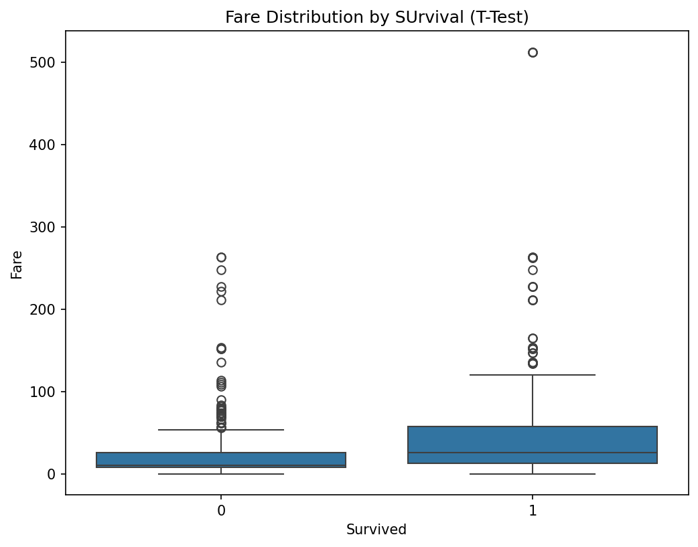
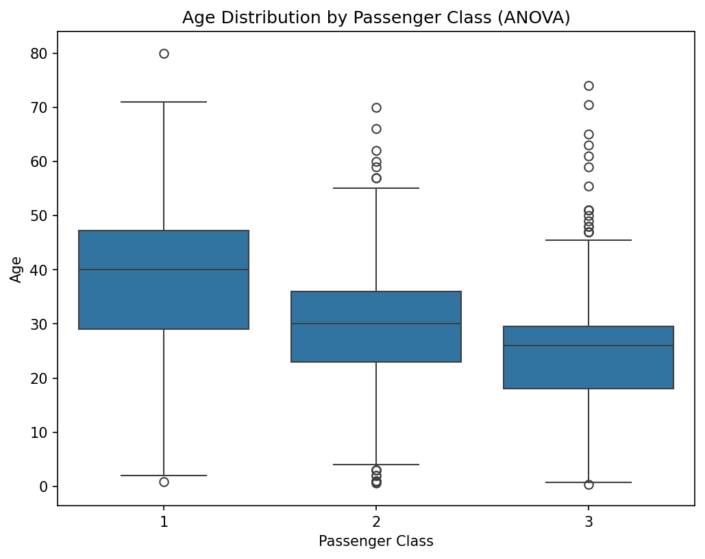
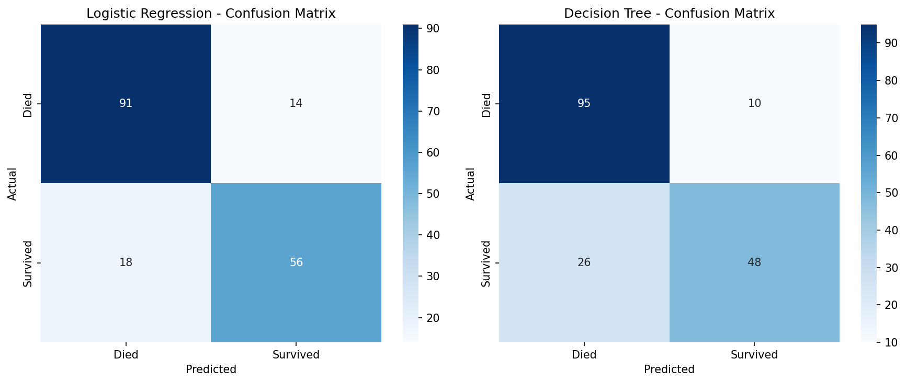
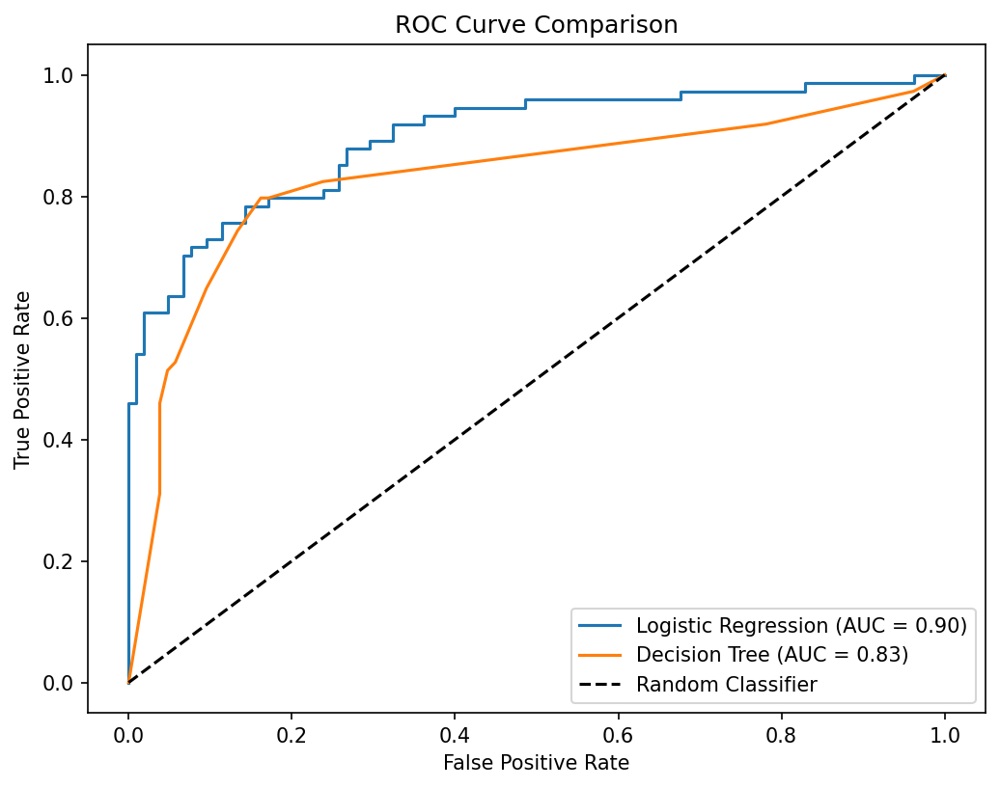

# 🚢 Titanic Survival Analysis

End-to-end data science project on the Titanic passenger dataset — data cleaning, exploratory analysis,
statistical hypothesis testing, and predictive modeling — completed as part of a 5-week Data Science
with Python virtual internship.

## Problem

Not every factor that determined who survived the Titanic disaster is obvious from raw data alone.
This project works through the full pipeline — from messy raw data to a tested, evaluated
classification model — to find out which passenger characteristics actually predicted survival,
and how confident we can be in each finding.

**Dataset:** [Titanic Passenger Data](https://raw.githubusercontent.com/datasciencedojo/datasets/master/titanic.csv) (891 passengers, 12 original columns)

## Approach

The project was split into four phases, each building on the one before it:

1. **Data cleaning & EDA (Week 1)** — inspected structure and quality, engineered a `Title` feature
   from passenger names, imputed missing `Age` values using the median within `Title` + `Pclass`
   groups, converted `Cabin` into a `Has_Cabin` flag, and filled missing `Embarked` values with the mode.
2. **Advanced visualization & storytelling (Week 2)** — moved from single-variable views to
   combined-variable views (family size, age × sex, title, age × fare) to see how features interact.
3. **Statistical hypothesis testing (Week 3)** — tested three hypotheses that came directly out of
   the Week 1–2 findings, using the test appropriate to each variable type.
4. **Predictive modeling (Week 4)** — trained and compared two classification models on 10 features
   using an 80/20 train/test split.

## Key Findings

| Finding | Evidence |
|---|---|
| **Sex was the dominant survival factor** | Women survived ~74% vs. ~19% for men (Chi-Square, p ≈ 1.2×10⁻⁵⁸) |
| **Class and fare mattered, though less strongly** | Survival fell from ~63% (1st) → ~47% (2nd) → ~24% (3rd); survivors paid more on average, $48.40 vs $22.12 (Welch's t-test, p ≈ 2.7×10⁻¹¹) |
| **Age alone barely mattered — but interactions did** | Age vs. survival correlation was just −0.06 on its own, yet age combined with sex revealed that young boys survived meaningfully more often than adult men |
| **A simple model predicted survival correctly ~82% of the time** | Logistic Regression: 82.1% accuracy, AUC 0.90 — ahead of a depth-capped Decision Tree (79.9% accuracy, AUC 0.83) |

<p align="center">
  
  
</p>

<p align="center">
  
  
</p>

## Statistical Testing

Three hypotheses, each tested with the method suited to its variable types — the null hypothesis
(no real relationship/difference) was **rejected for all three**, confirming the visual patterns
were statistically real rather than coincidental:

| # | Hypothesis | Test | Result |
|---|---|---|---|
| H1 | Survival is related to Sex | Chi-Square | χ² = 260.72, p ≈ 1.2×10⁻⁵⁸ |
| H2 | Survivors paid a higher Fare | Welch's t-test | t = 6.84, p ≈ 2.7×10⁻¹¹ |
| H3 | Age differs across Passenger Class | One-way ANOVA | F = 94.82, p ≈ 4.7×10⁻³⁸ |

<p align="center">
  
  
  
</p>

## Predictive Modeling

Two classifiers were trained on 10 features (`Pclass`, `Sex`, `Age`, `SibSp`, `Parch`, `Fare`,
`Embarked`, `Has_Cabin`, `Title`, `FamilySize`) after dropping `Name`, `Ticket`, and `PassengerId`
as unique identifiers with no generalizable signal.

| Model | Accuracy | AUC | Precision (Survived) | Recall (Survived) |
|---|---|---|---|---|
| **Logistic Regression** | **82.1%** | **0.90** | 0.80 | 0.76 |
| Decision Tree (max_depth=5) | 79.9% | 0.83 | 0.83 | 0.65 |

Logistic Regression won on both accuracy and AUC — but the more useful finding was in the
confusion matrices: the Decision Tree missed 26 actual survivors (35% of that class) because it
defaults to predicting "died" whenever uncertain, while Logistic Regression's errors were spread
more evenly across both classes. In any safety-critical use case, that distinction matters more
than the 2-point accuracy gap.

<p align="center">
  
  
</p>

## Project structure

```
├── notebooks/
│   └── Titanic_Survival_Analysis.ipynb   # full Week 1–4 analysis, cleaning → modeling
├── images/                               # saved charts referenced in this README
└── requirements.txt
```

## Run locally

```
git clone https://github.com/mvirani878/Titanic-Survival-Analysis.git
cd Titanic-Survival-Analysis
pip install -r requirements.txt
jupyter notebook notebooks/Titanic_Survival_Analysis.ipynb
```

## Tech stack

Python · pandas · NumPy · scikit-learn · SciPy · Matplotlib · Seaborn

## Limitations

- Family-size groups of 5+ are based on small samples (6–22 people), so those survival-rate
  figures are noisier than the 1–4 person groups.
- ANOVA confirms passenger classes differ in age overall but doesn't identify which specific
  pairs differ — a Tukey HSD post-hoc test would be the natural next step.
- Statistical significance shows the relationships are real, not that any single factor
  *caused* survival on its own — historical context (e.g. evacuation priority) supports a causal
  reading, but that inference comes from outside the data.

## Author

**M Virani** · [GitHub](https://github.com/mvirani878) 
